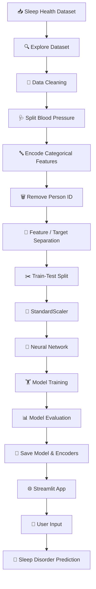

# 😴 Sleep Health & Lifestyle — Sleep Disorder Prediction

<p align="center">


<br>


</p>

---

## 🌙 About The Project

**Sleep Health & Lifestyle Predictor** is an end-to-end **Deep Learning classification project** designed to predict a person's **sleep disorder category** using health, lifestyle, and daily activity information.

The project takes raw lifestyle data and transforms it into an intelligent prediction pipeline:

```text
👤 Personal Data
      ↓
🧹 Data Cleaning
      ↓
⚙️ Feature Engineering
      ↓
🔤 Categorical Encoding
      ↓
📏 Feature Scaling
      ↓
🧠 Deep Learning Model
      ↓
📊 Model Evaluation
      ↓
💾 Model Serialization
      ↓
🌐 Streamlit Application
      ↓
😴 Sleep Disorder Prediction
```

> 💡 **Goal:** Explore how machine learning can identify patterns between lifestyle factors and sleep health.

---

# ✨ Key Features

| 🚀 Feature             | 📌 Description                                  |
| ---------------------- | ----------------------------------------------- |
| 🧹 Data Cleaning       | Handles missing sleep-disorder values           |
| 🔧 Feature Engineering | Converts blood pressure into numerical features |
| 🔤 Encoding            | Encodes categorical variables                   |
| 📏 Scaling             | Standardizes numerical features                 |
| 🧠 Deep Learning       | Neural network with Dense + Dropout layers      |
| 📊 Evaluation          | Tracks accuracy and loss                        |
| 💾 Model Saving        | Stores model and preprocessing objects          |
| 🌐 Streamlit           | Interactive prediction dashboard                |
| ⚡ Real-Time Prediction | Generates predictions from user inputs          |

---

# 🧬 Machine Learning Workflow



---

# 🧠 Deep Learning Architecture

The project uses a **fully connected neural network** for multi-class classification.

```text
                    👤 INPUT
                       │
                       ▼
          ┌─────────────────────────┐
          │   🧬 Health Features    │
          │   Lifestyle Features    │
          └────────────┬────────────┘
                       │
                       ▼
          ┌─────────────────────────┐
          │ 🧠 Dense Layer          │
          │     128 Neurons         │
          │     ReLU Activation     │
          └────────────┬────────────┘
                       │
                       ▼
          ┌─────────────────────────┐
          │ 🛡️ Dropout              │
          │       30%               │
          └────────────┬────────────┘
                       │
                       ▼
          ┌─────────────────────────┐
          │ 🧠 Dense Layer          │
          │      64 Neurons         │
          │     ReLU Activation     │
          └────────────┬────────────┘
                       │
                       ▼
          ┌─────────────────────────┐
          │ 🛡️ Dropout              │
          │       30%               │
          └────────────┬────────────┘
                       │
                       ▼
          ┌─────────────────────────┐
          │ 🎯 Softmax Output       │
          │   Multi-Class Prediction│
          └────────────┬────────────┘
                       │
                       ▼
                😴 SLEEP DISORDER
```

---

# 📊 Input Features

The model uses health and lifestyle variables including:

### 👤 Personal Information

* 🚻 Gender
* 🎂 Age
* 💼 Occupation

### 😴 Sleep Metrics

* 🛌 Sleep Duration
* ⭐ Quality of Sleep

### 🏃 Lifestyle

* 🏋️ Physical Activity Level
* 😰 Stress Level
* ⚖️ BMI Category
* 👟 Daily Steps

### ❤️ Health Metrics

* ❤️ Heart Rate
* 🩸 Systolic Blood Pressure
* 🩸 Diastolic Blood Pressure

### 🎯 Target

**Sleep Disorder**

The target is label-encoded and converted to one-hot representation for neural-network training.

---

# 🧹 Data Preprocessing

The preprocessing pipeline consists of several stages.

### 1️⃣ Missing Values

Missing values in `Sleep Disorder` are replaced with:

```text
None
```

### 2️⃣ Blood Pressure Engineering

Original:

```text
Blood Pressure = "126/83"
```

Converted into:

```text
Systolic_BP  = 126
Diastolic_BP = 83
```

### 3️⃣ Categorical Encoding

The following variables are encoded:

```text
🚻 Gender
💼 Occupation
⚖️ BMI Category
😴 Sleep Disorder
```

### 4️⃣ Identifier Removal

`Person ID` is removed because it is an identifier rather than a predictive feature.

### 5️⃣ Feature Scaling

`StandardScaler` is applied to the feature set.

### 6️⃣ Train-Test Split

```text
📚 Training → 80%
🧪 Testing  → 20%
```

Stratified splitting is used to preserve the target-class distribution.

---

# ⚙️ Model Configuration

| 🧩 Component     | ⚙️ Configuration          |
| ---------------- | ------------------------- |
| Architecture     | Sequential Neural Network |
| Hidden Layer 1   | 128 neurons               |
| Activation       | ReLU                      |
| Dropout          | 30%                       |
| Hidden Layer 2   | 64 neurons                |
| Activation       | ReLU                      |
| Output           | Softmax                   |
| Optimizer        | Adam                      |
| Loss             | Categorical Crossentropy  |
| Metric           | Accuracy                  |
| Epochs           | 50                        |
| Batch Size       | 32                        |
| Validation Split | 20%                       |

---

# 📈 Training & Evaluation

During training, the project tracks:

```text
📈 Training Accuracy
📊 Validation Accuracy
📉 Training Loss
📉 Validation Loss
```

The trained model is evaluated against the held-out test dataset.

> 📌 The exact final accuracy should be added to this README from your final notebook run rather than using an estimated value.

Example:

```text
🎯 Test Accuracy: XX.XX%
📉 Test Loss: X.XXXX
```

---

# 💾 Saved Model Assets

After training, the project stores the required ML artifacts inside:

```text
model_assets/
│
├── 🧠 deep_learning_model.keras
├── 📏 scaler.pkl
├── 🏷️ le_sleep_disdisorder.pkl
└── 🔤 other_label_encoders.pkl
```

This makes it possible to use the trained model without retraining every time the application starts.

---

# 🌐 Streamlit Application

The project includes an interactive **Streamlit prediction application**.

```text
             🌐 STREAMLIT
                  │
                  ▼
        ┌───────────────────┐
        │ 👤 User Inputs    │
        └─────────┬─────────┘
                  │
                  ▼
        ┌───────────────────┐
        │ 🔤 Label Encoding │
        └─────────┬─────────┘
                  │
                  ▼
        ┌───────────────────┐
        │ 📏 Feature Scaling│
        └─────────┬─────────┘
                  │
                  ▼
        ┌───────────────────┐
        │ 🧠 Neural Network │
        └─────────┬─────────┘
                  │
                  ▼
        ┌───────────────────┐
        │ 🔮 Prediction     │
        └─────────┬─────────┘
                  │
                  ▼
              😴 RESULT
```

---

# 🎛️ Application Inputs

Users can interactively provide:

```text
🚻 Gender
🎂 Age
💼 Occupation
🛌 Sleep Duration
⭐ Quality of Sleep
🏃 Physical Activity Level
😰 Stress Level
⚖️ BMI Category
❤️ Heart Rate
👟 Daily Steps
🩸 Systolic Blood Pressure
🩸 Diastolic Blood Pressure
```

Then simply click:

### 🔮 Predict Sleep Disorder

---

# 📁 Project Structure

```text
😴 Sleep-Health-and-Lifestyle/
│
├── 📓 Sleep_Health_and_Lifestyle_.ipynb
│
├── 🌐 app.py
│
├── 📂 model_assets/
│   ├── 🧠 deep_learning_model.keras
│   ├── 📏 scaler.pkl
│   ├── 🏷️ le_sleep_disdisorder.pkl
│   └── 🔤 other_label_encoders.pkl
│
├── 📄 requirements.txt
│
└── 📖 README.md
```

---

# 🛠️ Tech Stack

<p align="center">

| 🔧 Technology   | 💡 Purpose              |
| --------------- | ----------------------- |
| 🐍 Python       | Programming             |
| 🐼 Pandas       | Data Processing         |
| 🔢 NumPy        | Numerical Computing     |
| 📊 Matplotlib   | Visualization           |
| 🎨 Seaborn      | Visualization           |
| 🤖 Scikit-learn | Preprocessing           |
| 🧠 TensorFlow   | Deep Learning           |
| 🔥 Keras        | Neural Network          |
| 🌐 Streamlit    | Web Application         |
| 💾 Joblib       | Model Persistence       |
| ☁️ Google Colab | Development Environment |

</p>

---

# 🚀 Installation

Clone the repository:

```bash
git clone https://github.com/<your-username>/Sleep-Health-and-Lifestyle.git
cd Sleep-Health-and-Lifestyle
```

Install dependencies:

```bash
pip install -r requirements.txt
```

Example:

```text
pandas
numpy
matplotlib
seaborn
scikit-learn
tensorflow
keras
joblib
streamlit
```

---

# ▶️ Run the Application

Start the Streamlit application:

```bash
streamlit run app.py
```

Then open the local URL provided by Streamlit.

```text
🌐 Local Application
        ↓
👤 Enter Health Metrics
        ↓
🔮 Predict
        ↓
😴 Sleep Disorder Result
```

---

# ☁️ Google Colab Deployment

The notebook also demonstrates running the Streamlit application through **ngrok** from Google Colab.

```text
☁️ Google Colab
      │
      ▼
🧠 Train Model
      │
      ▼
💾 Save Model
      │
      ▼
🌐 Launch Streamlit
      │
      ▼
🔗 ngrok Tunnel
      │
      ▼
🌍 Public URL
```

### 🔐 Security Warning

**Never commit an ngrok authentication token to GitHub.**

If a real token exists in the notebook, revoke it and generate a new one before publishing the repository.

Use environment variables or secrets instead.

---

# 📚 What I Learned

This project strengthened practical understanding of:

```text
🧹 Data Cleaning
        ↓
🔧 Feature Engineering
        ↓
🔤 Categorical Encoding
        ↓
📏 Feature Scaling
        ↓
🧠 Neural Networks
        ↓
🏋️ Model Training
        ↓
📊 Model Evaluation
        ↓
💾 Model Deployment
        ↓
🌐 Interactive ML Application
```

### 💡 Key Takeaways

* How to transform real-world health data into ML-ready data
* How to build a multi-class neural network
* How Dropout can be incorporated into a neural network
* How to save preprocessing objects alongside a trained model
* How to connect a trained ML model to Streamlit
* How to build an end-to-end ML application

---

# 🔮 Future Roadmap

### 🧠 Model Improvements

* [ ] 🔍 Hyperparameter tuning
* [ ] 🔄 Cross-validation
* [ ] 🧪 Compare multiple ML algorithms
* [ ] 📊 Confusion matrix
* [ ] 📈 Precision / Recall / F1-score
* [ ] 🔎 Feature importance analysis
* [ ] ⚡ Early stopping
* [ ] 🛡️ Advanced regularization

### 🌐 Application Improvements

* [ ] 🎨 Modern dashboard UI
* [ ] 📊 Interactive health charts
* [ ] 📈 Sleep trend analysis
* [ ] 📋 Prediction history
* [ ] 📥 Downloadable reports
* [ ] 📱 Mobile-friendly interface
* [ ] ☁️ Cloud deployment
* [ ] 🔐 User authentication

### 🚀 Version 2.0 Vision

```text
                😴 SLEEP AI
                    │
        ┌───────────┼───────────┐
        ▼           ▼           ▼
     🧠 PREDICT   📊 ANALYZE   💡 INSIGHTS
        │           │           │
        └───────────┼───────────┘
                    ▼
             🌐 HEALTH DASHBOARD
```

---

# ⚠️ Disclaimer

This project is intended for **educational and experimental purposes only**.

The predictions generated by this system should **not be considered medical diagnosis or professional medical advice**.

Always consult a qualified healthcare professional for medical concerns.

---

# ⭐ Show Your Support

If you find this project useful:

⭐ **Star** the repository
🍴 **Fork** the project
🐛 **Report** issues
💡 **Suggest** improvements
🔗 **Share** it with others

Every contribution helps! 🚀

---

# 👨‍💻 Author

## **Aravind**

🎓 AI & Data Science Student
🧠 Machine Learning Enthusiast
🤖 Deep Learning Developer
📊 Data Science Explorer
🚀 Building AI-powered solutions

---

<p align="center">

### 💭 Turning Lifestyle Data into Intelligent Insights

**Data 📊 → Intelligence 🧠 → Prediction 🔮 → Impact 🚀**

<br>

⭐ **If you like this project, don't forget to star the repository!** ⭐

</p>
